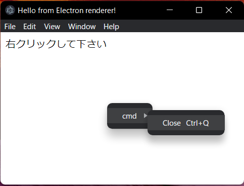

### 実行例
右クリックするとメニューが表示されます  
  

## 使用法 
### 確認環境
windows11
node.js：16.17.0  
electron：20.1.3  

## 使用法 
### npmを使用した初期化 
```
$ npm init -y
```
### electronを環境に追加
```
$ npm install electron --save-dev
```
### package.jsonの修正
```
$ vim package.json
- "main": "index.js",
+ "main": "./src/main.js",
- "package-name": "echo \"Error: no test specified\" && exit 1"
+ "start": "electron ."
```
### 起動
```
$ npm start
```